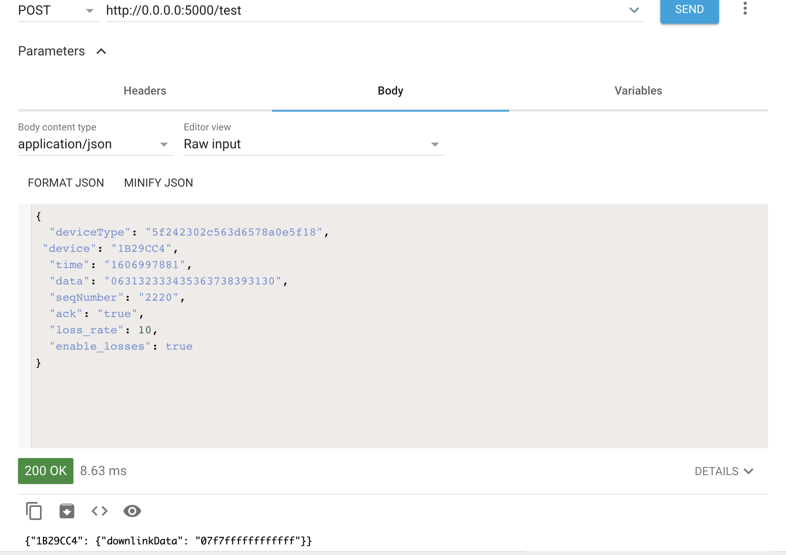

# SCHC-over-SigFox

## Objectives

While testing the integration between LoPy4-SigFox-GCF, it becomes difficult to perform testing in an efficient way due to the time requiered to upload code and check the result logs.

To solve this issue, a local flask server is build to simulate the behaviour of the Google Cloud Function and a Rest client is used to simulate the message posting. This allows local testing to debug the code that will be deploy to google cloud.

## Setup

Create a folder called credentials.
Download the credentials from Google Cloud.

To get the credentials, go to Google Cloud Console.
Go to APIs & Services.
Go to Credentials.

In Credentials, click "Create Credentials", "Service Account". 
Give name, Service account ID and description. 

Download "your_credentials.json" to the /credentials folder created before. 

In config/config.py, replace the PATH to your credential file.
```
CLIENT_SECRETS_FILE = '/PATH/credentials/your_credentials.json'
```

Also update the Bucket name used for the storage.

```
BUCKET_NAME = 'your-bucket-name'
```
## Execution

At this point, the test is done in the following way:
* Install requirements.txt (recommended in a venv) 
* Run the flask test server in the venv.
```
python3 test_server.py
```
Excepted result

``` Running on http://0.0.0.0:5000/test (Press CTRL+C to quit)```

* Open AdvanceREST (app for Chrome browser for send html requests).
* Set the method to POST. Set Resquest URL to: ```http://0.0.0.0:5000/post/message```
(check that IP and port are the same as shown when running the flask server as shown above.)


* In Body, add ```application/json``` and add
```json
{
  "deviceType": "01B29CC4",
  "device": "1B29CC4",
  "time": "1596713121",
  "data": "86970",
  "seqNumber": "39",
  "ack": "false"
}
```
Note that the data field is a All-1 message.
* In Headers add 
```
Header Name: Content-Type
Header Value: application/json
``` 
* Click send.

Actual output of the flask server:
```
[before_request]: test
Data received from device id:1B29CC4, data:063132333435363738393130
response -> {'1B29CC4': {'downlinkData': '07f7ffffffffffff'}}
[after_request]: execution time: 0.0002422332763671875
```
Output of AdvanceREST




## Enable statistics

The statitics are collected using the before and after function of the flask server.

The end point that will receive the request should be configured

```python
    if request.endpoint == 'wyschc_get':
```

An output file with the fragment information will be store here

```python
filename = '/fragments_stats_v2.7.json'
```

For each new transmission the version of the file should be modify.
It can be the same version as the LoPy stats file.


