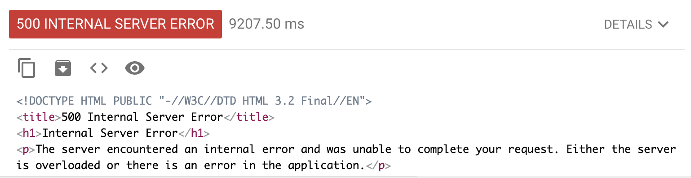

# SCHC-over-SigFox

## Objectives

While testing the integration between LoPy4-SigFox-GCF, it becomes difficult to perform testing in an efficient way due to the time requiered to upload code and check the result logs.

To solve this issue, a local flask server is build to simulate the behaviour of the Google Cloud Function and a Rest client is used to simulate the message posting. This allows local testing to debug the code that will be deploy to google cloud.

## Setup

Create a folder called credentials.
Download the credentials from Google Cloud.

To get the credentials, go to Google Cloud Console.
Go to APIs & Services.
Go to Credentials.

In Credentials, click "Create Credentials", "Service Account". 
Give name, Service account ID and description. 

Download "your_credentials.json" to the /credentials folder created before. 

In config/config.py, replace the PATH to your credential file.
```
CLIENT_SECRETS_FILE = '/PATH/credentials/your_credentials.json'
```

Also update the Bucket name used for the storage.

```
BUCKET_NAME = 'your-bucket-name'
```
## Execution

At this point, the test is done in the following way:
* Install requirements.txt (recommended in a venv) 
* Run the flask test server in the venv.
```
python3 test_server.py
```
Excepted result

``` Running on http://0.0.0.0:5000/ (Press CTRL+C to quit)```

* Open AdvanceREST (app for Chrome browser for send html requests).
* Set the method to POST. Set Resquest URL to: ```http://0.0.0.0:5000/post/message```
(check that IP and port are the same as shown when running the flask server as shown above.)


* In Body, add ```application/json``` and add
```json
{
  "deviceType": "01B29CC4",
  "device": "1B29CC4",
  "time": "1596713121",
  "data": "86970",
  "seqNumber": "39",
  "ack": "false"
}
```
Note that the data field is a All-1 message.
* In Headers add 
```
Header Name: Content-Type
Header Value: application/json
``` 
* Click send.

Actual output of the flask server:
```
POST RECEIVED
Received Sigfox message: {'deviceType': '01B29CC4', 'device': '1B29CC4', 'time': '1596713121', 'data': '86970', 'seqNumber': '39', 'ack': 'false'}
File uploaded to timestamp.
File uploaded to timestamp.
BLOB Created
fragment 8,6970
data [b'8', bytearray(b'6970')]
[RECV] This corresponds to the 6th fragment of the 3th window.
[RECV] Sigfox sequence number: 39
File uploaded to all_windows/window_3/bitmap_3.
File uploaded to all_windows/window_3/fragment_3_6.
File uploaded to SSN.
[2020-08-14 18:24:17,742] ERROR in app: Exception on /post/message [POST]
Traceback (most recent call last):
  File "/Users/sergioaguilar/PycharmProjects/SCHCfox/venv/lib/python3.7/site-packages/flask/app.py", line 2447, in wsgi_app
    response = self.full_dispatch_request()
  File "/Users/sergioaguilar/PycharmProjects/SCHCfox/venv/lib/python3.7/site-packages/flask/app.py", line 1952, in full_dispatch_request
    rv = self.handle_user_exception(e)
  File "/Users/sergioaguilar/PycharmProjects/SCHCfox/venv/lib/python3.7/site-packages/flask/app.py", line 1821, in handle_user_exception
    reraise(exc_type, exc_value, tb)
  File "/Users/sergioaguilar/PycharmProjects/SCHCfox/venv/lib/python3.7/site-packages/flask/_compat.py", line 39, in reraise
    raise value
  File "/Users/sergioaguilar/PycharmProjects/SCHCfox/venv/lib/python3.7/site-packages/flask/app.py", line 1950, in full_dispatch_request
    rv = self.dispatch_request()
  File "/Users/sergioaguilar/PycharmProjects/SCHCfox/venv/lib/python3.7/site-packages/flask/app.py", line 1936, in dispatch_request
    return self.view_functions[rule.endpoint](**req.view_args)
  File "/Users/sergioaguilar/PycharmProjects/SCHCfox/test_server.py", line 149, in post_message
    bitmap_ack = read_blob(BUCKET_NAME, "all_windows/window_%d/bitmap%d" % (i, i))
  File "/Users/sergioaguilar/PycharmProjects/SCHCfox/blobHelperFunctions.py", line 16, in read_blob
    return blob.download_as_string()
AttributeError: 'NoneType' object has no attribute 'download_as_string'
127.0.0.1 - - [14/Aug/2020 18:24:17] "POST /post/message HTTP/1.1" 500 -

```
Output of AdvanceREST




## Next Steps

* Solve issues of read_blob function. 
* Modify the sender.py to enable Rest api communications with the server.
* Continue testing to make ACK-on-Error work on the cloud.


