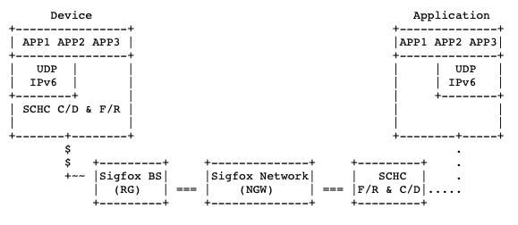

# End-to-end communication testing

 The objective of this tutorial is to show the necessary steps to setup end-to-end communication between a LoPy4 device and Google Cloud Function (GCF), using the Sigfox Radio Network.
  The GCF is configured as an end point in the Sigfox Cloud with bidirectional communication.
  
  All these steps are required to step up the SCHC fragmentation functionality over the Sigfox network.
 
 ### Generic Framework for Static Context Header Compression and Fragmentation (SCHC) [[RFC 8724](https://www.rfc-editor.org/rfc/rfc8724.html)]
 
 SCHC is a framework for Low Power Wide Area Networks (LPWAN) that enable IPv6 header compression and fragmentation functionality, when is not natively provided by the network.
 
 SCHC is composed of two layers: Compression/Decompression (C/D) and Fragmentation/Reassemble (F/R). These layers sit between the IPv6 layer and the LPWAN technology. The C/D layer performes the IPv6 header compression and the F/R optionally fragments the compressor output when it does not fit in a single Layer 2 Frame. [[RFC 8724](https://www.rfc-editor.org/rfc/rfc8724.html)]
 
 [[RFC 8724](https://www.rfc-editor.org/rfc/rfc8724.html)]

The output of the SCHC compressor is called the SCHC Packet and fragmentation is performed over the SCHC Packet. 
However, the SCHC Packet is not only limited to a compressed IPv6 packet, as it can also be any application data that is required to be transmitted over an scared-resource link. 
For example, if the required data to be transmitted (e.g. sensor measurements) is 150 bytes long and the available payload for transmission is only 50 bytes.

Note that the Sigfox payload is limited in uplink to 12 bytes and in downlink to 8 bytes. This means that if more than 12 bytes are required to be sent in uplink, SCHC fragmentation can be used. 
In the same way, if more than 8 bytes are required to be sent to the device in downlink, SCHC fragmentation can be used.
 
 
 ### Architecture
 
 According to the Generic Framework for Static Context Header Compression and Fragmentation (SCHC [RFC 8724](https://www.rfc-editor.org/rfc/rfc8724.html)), the general LPWAN architecture consists of the following elements:
 
 * Devices (Dev) are the end-devices or hosts (e.g., sensors, actuators, etc.). There can be a very high density of devices per Radio Gateway.
 * The Radio Gateway (RGW) is the endpoint of the constrained link.
 * The Network Gateway (NGW) is the interconnection node between the Radio Gateway and the Internet.
 * The Application Server (App) is the endpoint of the application-level protocol on the Internet side.
 
To leverage each LPWAN technology, each technology defines a Profile that adapt SCHC configuration and Fragmentation/Reassemble (F/R) modes according to its characteristics. 
More specifically, the [SCHC-over-Sigfox](https://www.ietf.org/id/draft-ietf-lpwan-schc-over-sigfox-03.txt) draft, adapts the SCHC framework to optimally work over the Sigfox radio links. 
The architecture below shows the replacement of the elements shown before with the Sigfox Network elements.
 
 
 
The objective of this tutorial is the following test scenario, were the LoPy4 (Device) is connected to the Sigfox Base Station (Radio Gateway). 
 The Sigfox Base Stations communicates with the Sigfox Cloud (Network Gateway) which sends the messages to the Google Cloud Function (SCHC F/R). 
 This architecture is shown below.
 
 

## Setup steps for end to end communication testing

The following steps are required to test the communication end-to-end (LoPy4<->Sigfox<->GCF). A GCF will be setup as an example for bireccional communication, the LoPy will be connected to obtain the Sigfox network information that later will be required to create a Sigfox Backend account. Then the end-point is configured in the Sigfox Backend, and messages are send from the LoPy to the GCF using the Sigfox network.

1. Create a Google Cloud Function. [Tutorial 2](/docs/Tutorial-2-cloud-function-setup.md)
2. Configure the IDE (vscode or atom) with the extension to support Pycom devices (pymark). [Tutorial 3](/docs/Tutorial-3-lopy-setup-vscode.md)
3. Configure the Google Cloud Function as an end-point in Sigfox Cloud. [Tutorial 4](/docs/Tutorial-4-Sigfox-callback_setup.md)
4. Run end-to-end test (LoPy4<->Sigfox<->GCF) [Tutorial 5](/docs/Tutorial-5-test-end-to-end.md)
5. Migrate the Storage Bucket to Firebase Realtime Database [Migration Guige](/docs/firebase-migration.md)