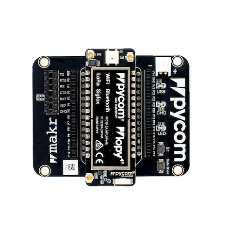
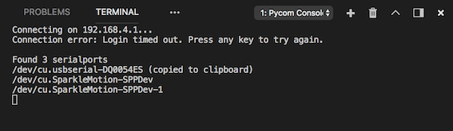
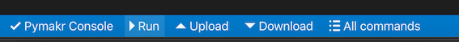

# LoPy Setup in vscode (Tutorial 3)

The objective of this tutorial is to show how to setup the LoPy4 in the Visual Studio Code (vscode).

The installation guide is based in the pycom [documentation.](https://docs.pycom.io/gettingstarted/software/vscode/)

Pycom supports Microsoft’s Visual Studio Code IDE platform with the Pymakr Plugin.

1. First download and install [Visual Studio Code](https://code.visualstudio.com/).

2. You will also need NodeJS installed on your PC. Please download the latest LTS version available [from the NodeJS website](https://nodejs.org/).

Please follow these steps to install [the Pymakr VSCode Extension](https://marketplace.visualstudio.com/items?itemName=pycom.Pymakr):

3. Ensure that you have the latest VSCode installed and open.

4. Navigate to the Extensions page, using the 5th button in the left navigation.

5. Search for Pymakr and click the install button next to it.

6. Within a few minutes, a reload button should appear. Press it to reload VSCode.

7. Clone and open the project from [this](https://github.com/saguilarDevel/schc-sigfox) repository.

8. Prepare the LoPy for connection to the computer.

9. Note that the LoPy4 is connected to the expansion board previously as follows: 

10. Connect the antenna to the corresponding port of the LoPy4. 

12. Connect the LoPy4 device to your computer using the USB Port.

13. Ensure that the Pymakr Plugin has correctly installed.

14. Generally, your device will be auto-detected. If this does not work, click All commands on the bottom of the Visual Studio Code window.

15. In the list that appears, click Pymakr > Extra > List Serial Ports.

16. This will list the available serial ports. If Pymakr is able to auto-detect which to use, this will be copied to your clipboard. If not please manually copy the correct serial port in Project Settings. Example of serials ports shown below.

17. Open check_sigfox.py from /Testing folder.

17. Run the check_sigfox.py file in the LoPy4 by clicking in the menu below and click Run current file.

18. The file will be executed.

19. It should print the Sigfox Device ID and the Sigfox PAC number. This information is latter required to create the Sigfox Backend account.

Continue with the Sigfox Callback configuration in [Tutorial 4](/docs/Tutorial-4-Sigfox-callback_setup.md).