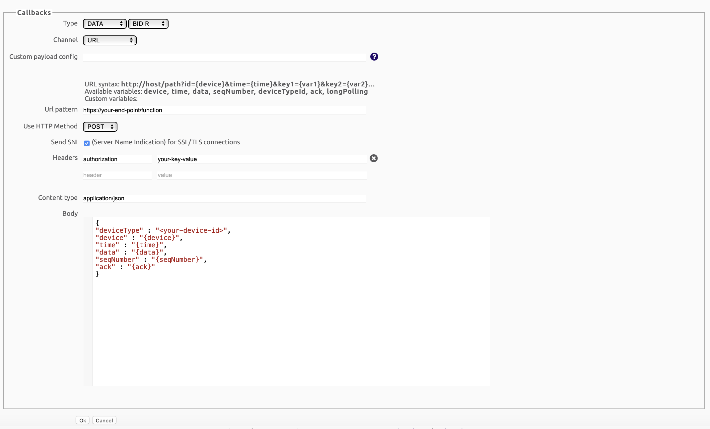

# Callback Setup in Sigfox Cloud

The objective of this tutorial is to show how to configure the callbacks in the Sigfox Cloud.

## Create an account at Sigfox Backend

To register the LoPy4 in the Sigfox Cloud, first you must [Activate](https://buy.sigfox.com/activate) an account.

To Activate the Sigfox account, the ID and PAC of the LoPy are required. 

## Creating the Callback

The following are the steps required to create the callback in the Sigfox Cloud:

1. Login to Sigfox [backend](https://backend.sigfox.com) and go to the "Devices" tab.
2. Click in the value corresponding to your device in the column "Device Type".
3. In the left Menu, go to "Callbacks".
4. In the right top corner click on "New".
5. Select "Custom Callback".
6. Type the following values:
* Type: DATA, BIDIR
* Channel: URL
* Url pattern: ​<url of your end point>
* Use HTTP Method: POS
* Send SNI: {check}
* Headers: authorization, Basic ​<tu token de la cloud function>
* Content type: application/json
* Body:
```json
{
    "deviceType" : "​<device name>​",
    "device" : "{device}",
    "time" : "{time}",
    "data" : "{data}",
    "seqNumber" : "{seqNumber}",
    "ack" : "{ack}"
}
```

The result of the configuration should look as follows:



7.  Save the callback configuration by clicking OK.
8. Verify the correct creation of the callback in the callback page, as follows: 


The callback can be enable and disable with the Enable checkbox. Check that the callback is enable with a SubType BIDIR.


