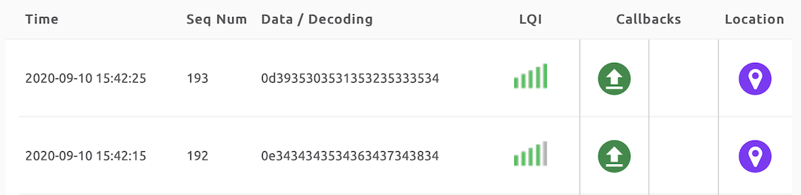
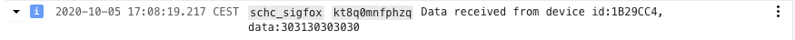
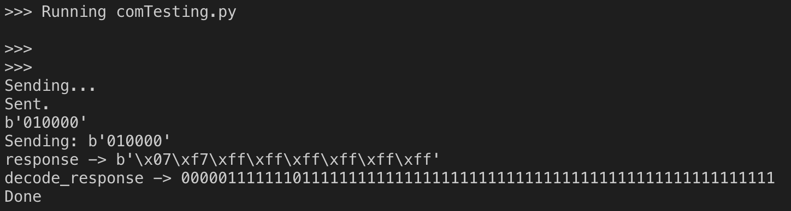
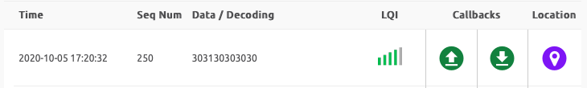
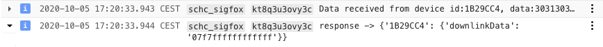

# End-to-end Test (Tutorial 5)

One the GFC is created, the Sigfox Backend account is configured and the IDE is ready, the LoPy can begin sending messages thru the Sigfox Cloud to the GCF.

## Unidirectional tests (uplink only)

The first test is a unidirectional test, where the LoPy4 sends a message to the GCF without waiting for an answer.

1. Open the file located in /Testing called beacon.py.


2. The beacon.py script sends n = 10 messages to the Sigfox network. This test is build to test the connectivity between the LoPy4, the Sigfox Cloud and the end point. (only one message is required to test the Sigfox connectivity and the correct end point configuration).

```
>>> Running beacon.py

>>>
>>>
Sending...
Sent.
b'010000'
Sending...
Sent.
b'010001'
Done
```

3. The number of sent messages depends on the "n" configuration. In the previous example n = 2.


## Review Sigfox callback configuration.

Go to the Sigfox Backend page and navigate to Device -> Your-device-ID -> Messages. Check the column "Callbacks". The test is OK if all messages arrived and have a green arrow and a red arrow downwards.



The green arrow upward indicates the status of the message send from device to the Sigfox Cloud, and the downward arrow indicates, that the device has open the reception windows, if red no message was send to the device.

In Google Cloud Console, go to Logging, Logs Viewer. Set the Cloud Function and a log should be found with the informatino of the data sent.



## Bidirectional tests (Device to Cloud)

In the bidirectional test messages are sent from the LoPy4 device to the Cloud and a response is sent back to the device. 
To test the response from the GCF, open from /Testing comTesting.py.

In the comTesting.py the n can be configured to send more than one message. 



The response content of the end point previously configured in the callback in the Sigfox Cloud is send back to device if the device requested a response (note that the LoPy4 should enable the reception window when a message is expected).




Check the Logs of the GFC. 



In the logs, the data received can be found and also the response that is sent back to the Sigfox Cloud.


Now the LoPy4 is sending and receiving messages from the GCF using the Sigfox Radio Network. The followings steps is to modify (or create a new) GCF that contains the SCHC receiver. Similarly, the LoPy4 code needs to the changed to run the SCHC sender.