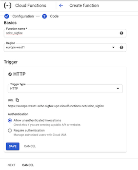

# Create Callback Function in Google Cloud (Tutorial 2)

The objetive of this tutorial is to configure a Google Cloud account to use the Google Cloud Function (GCF) to be use as an end point in the Sigfox Cloud.

## Create a Google Cloud account

Create a google cloud account, can be with a gmail address. More information from this tutorial can be found [here](https://cloud.google.com/functions/docs/quickstart-python) and [here](https://cloud.google.com/functions/docs/first-python).


1. In the Cloud Console, create or select a Cloud Project.

2. Make sure that billing is enabled for your Google Cloud project. (Enable the free tier, payment data must be included but it would not be billed, only if you spend all the free tier).

3. Enable the Cloud Functions and Cloud Build APIs.


### Create Cloud Storage Bucket (required for SCHC implementation in GCF)

1. Go to Menu, Storage.

2. Click on the Create Bucket button.

3. Give Bucket Name ex. ```sigfoxschc``` (save name for latter) and complete the creation form.


### Create Cloud Function

1. Go to Menu, Functions.
2. Click on the Create Function button.
3. Give the Cloud Function a name. Ex. ``` schc_sigfox```



4. Complete creation form, with region.
5. Set HTTP trigger.
6. Click the Allow unauthenticated invocations. (Security must be implemented by http headers)
7. Copy cloud function URL and save it for latter.
8. Click Save and Next.
9. Choose Python 3.7 as Runtime.
10. Copy the following code in main.py to the function.

```python
def schc_sigfox(request):
    """Responds to any HTTP request.
    Args:
        request (flask.Request): HTTP request object.
    Returns:
        The response text or any set of values that can be turned into a
        Response object using
        `make_response <http://flask.pocoo.org/docs/1.0/api/#flask.Flask.make_response>`.
    """
    import json
    request_json = request.get_json()
    # if request.args and 'device' in request.args:
    #    return request.args.get('message')
    if request_json and 'device' in request_json and 'data' in request_json:
        device = request_json['device']
        print('Data received from device id:{}, data:{}'.format(device, request_json['data']))
        if 'ack' in request_json:
            if request_json['ack'] == 'true':
                response = {request_json['device']: {'downlinkData': '07f7ffffffffffff'}}
                print("response -> {}".format(response))
                return json.dumps(response), 200
        return '', 204
    else:
        return f'Not a correct format message', 404

```
11. Change the Entry Point to ```schc_sigfox```
11. Click Deploy and wait for the function to be deploy.


The code deploy in the Cloud Function will process the message received from Sigfox Cloud (with a certain format). If the POST json message format is incorrect, a 404 error message will be returned. 
If the json message format is correct, the data received will be printed. Likewise, if the ack flag is set to true, which means that the device is waiting for a response, a downlink message is sent back to the Sigfox Cloud in the response, that will redirect the message to device that init the communication.

## Testing the GCF

To test the GCF, a plugin for chrome called Advance Rest Client is required. Furthermore, the GCF can be tested using curl. 

### Test without ACK

* Open Advance REST Client (app for Chrome browser for send html requests).


* Set the method to POST. 
* Set Resquest URL to your GFC (you can check in the Google Console): ```http://your-cloud-function-url/schc_sigfox```

* In Body, add ```application/json``` and add
```json
{
  "deviceType": "01B29CC4",
  "device": "1B29CC4",
  "time": "1596713121",
  "data": "86970",
  "seqNumber": "39",
  "ack": "false"
}
```
Note that the ack field is false, so no response is expected.
* In Headers add 
```
Header Name: Content-Type
Header Value: application/json
``` 
* Click send.


* The result is a 204 with no content.


### Test with ACK


* In Body, replace the "ack" flag value with "true"
```json
{
  "deviceType": "01B29CC4",
  "device": "1B29CC4",
  "time": "1596713121",
  "data": "86970",
  "seqNumber": "39",
  "ack": "true"
}
```
* Keep the same configuration and click send.


Now the response is a 200 OK with a json response. In this case, the device id is indicated with some downlink data.


Continue withe the LoPy setup in [Tutorial 3](/docs/Tutorials/Tutorial-3-lopy-setup-vscode.md-vscode.md).

