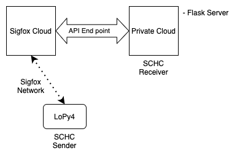
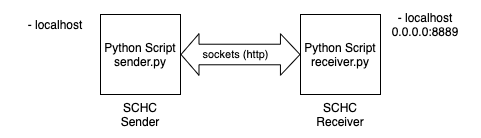
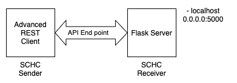
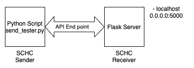
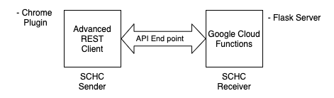
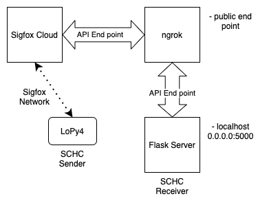

# Test setup for SCHC over Sigfox

## Objectives

Provide different ways of testing the schc over sigfox implementation.

The final goal is to connect a device (LoPy4) thru the Sigfox Cloud to a server (Google Cloud or Private Cloud) that enables SCHC (fragmentation) connectivity. 

## Connection Diagram

To enable SCHC connectivity over Sigfox, the device is connected to the Sigfox network. The messages sent by the device arrive to the Sigfox Cloud that retransmit the message payload and other information, such as the sequence number, timestamp and device type, device ID and ACK flag.


Example of Sigfox Cloud message send to Google Cloud Function.

```json
{
  "deviceType": "01B29CC4",
  "device": "1B29CC4",
  "time": "1596713121",
  "data": "303130303030",
  "seqNumber": "39",
  "ack": "false"
}
```

Furthermore, the Sigfox Cloud endopoint can be configure to a Private Cloud, running a Flask Server.




## Testing SCHC over Sigfox

To accomplish the final configuration, different test cases have been analyzed.

### Test case 1 - Local tests

The SCHC over Sigfox implementation was tested in local mode, using http sockets in localhost. 
This test setup allows a rapid implementation of the python code, as test are run locally.



### Test case 2 - Testing Server Code Locally

To test the code that will run on the server (Google Cloud or Private Cloud), the Sigfox Cloud (and the device) are replace by a http post sender tool (Advance REST Client in this case, curl is another option). This setup allows a simpler way to test the code running in the server, as it does not need to be deploy to the Cloud each time a change is made. 

A Flask server is run in localhost (port 5000), and messages are send to an endpoint in /post/messages. The messages are take from real messages send from the Sigfox Cloud.



### Test case 3 - Testing Server Code Locally Programmatically

To simulate the sending of messages more programmatically, a python script with a series of messages is configure to send the messages to the Flask server locally. 




### Test case 4 - Testing Google Cloud Function

Once the test in local provide good results, the server can be deploy to Google Cloud as a Function. To test the function without the need of the Sigfox Cloud, the Advanced REST Client can be use to send the messages. Also the Python script can be use to send the messages programmatically.



### Test case 5 - Testing LoPy, Sigfox Cloud and Google Cloud Function

With the Google Cloud Function (GCF) properly working, is possible to test the communication between the LoPy4 and the GCF, using the Sigfox Cloud as the LPWAN Radio GW.


The SCHC fragments are send from the LoPy to the Sigfox Cloud using the Sigfox radio network. Then, the Sigfox Cloud routes the messages to the end point previously configured (the Google Cloud Function URL). The messages arrive to the GCF that responds accordingly. If an ACK needs to be sent (in case of uplink communication), then the GCF will respond with a JSON file that contains the information required by the Sigfox Cloud to route the answer back to the device.

The response provided from the GCF has the format shown below. This format is provided by Sigfox in the [documentation](https://support.sigfox.com/docs/acknowledge). 
```json
{    "device_id":{
        "downlinkData":"deadbeefcafebabe"
     }
}
```
A real response of an ACK-on-Error communication is shown below.
```json
{    "1B29CC4": {
        "downlinkData": "07f7ffffffffffff"
     }
}
```
Note that the downlink data is the ACK in HEX format. 
The 'f' at the end are the padding bits required by the Sigfox network. 
Therefore, the ACK is padded until the 64 bits of the downlink L2 frame are completed.


#### Example messages

Example of a message between Sigfox Cloud and GCF. 
The Sigfox Cloud sends the data with the Sigfox message sequence number (seqNumber) and indicating if an ACK is requiered or not. The "ack" flags indicates whether or not the device (LoPy) has enable the reception window.

```json
{
    "deviceType": "01B29CC4", 
    "device": "1B29CC4", 
    "time": "1599745073", 
    "data": "013333333433353336333733", 
    "seqNumber": "181", 
    "ack": "false"
}
```


The Message below is between Sigfox Cloud and GCF asking for an ACK. This means that the LoPy has enable the reception window to allow the Sigfox Cloud to send a response back. 

```json
{
    "deviceType": "01B29CC4", 
    "device": "1B29CC4", 
    "time": "1599745083",
    "data": "003833393430343134323433",
    "seqNumber": "182",
    "ack": "true"
}
```

Other information that can be sent from the Sigfox Cloud to the GCF as part of the JSON message are: 

* Device ID
* Message Sequence Number
* Message Payload
* Message Timestamp
* Device Geolocation (optional)
* RSSI (optional)
* Device Temperature (optional)
* Device Battery Voltage (optional)

The Message Timestamp, Device Geolocation, RSSI, Device Temperature and Device Battery Voltage are metadata parameters provided by the Network. [[draft-ietf-lpwan-schc-over-sigfox-03]](https://www.ietf.org/id/draft-ietf-lpwan-schc-over-sigfox-03.txt)


### Test case 6 - Testing LoPy, Sigfox Cloud and Local Server using ngrok

For further testing of the cloud function locally, or if the function runs in a private server, the end point can be exposed using ngrok.
Ngrok creates a secure tunnel between a public end point and the flask server running locally, and can be used to enable communication from the Sigfox Cloud to the local Flask Server as shown in the image below.



To perform this test you must have an ngrok account and properly setup. More information [here](https://ngrok.com).

First the flask server must be up and running. Then, ngrok service can be started as follows:

```
ngrok http 5000
```

This will start the ngrok service and show the url you need to configure in the sigfox cloud. Check the enable and Downlink in the callback. The callback should look as follows:


Now the messages send from the LoPy are forwarded from the Sigfox Cloud to the local Flask server.


