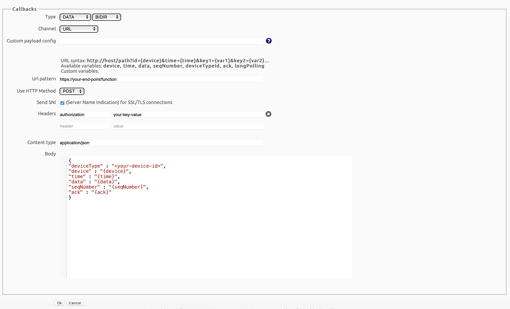
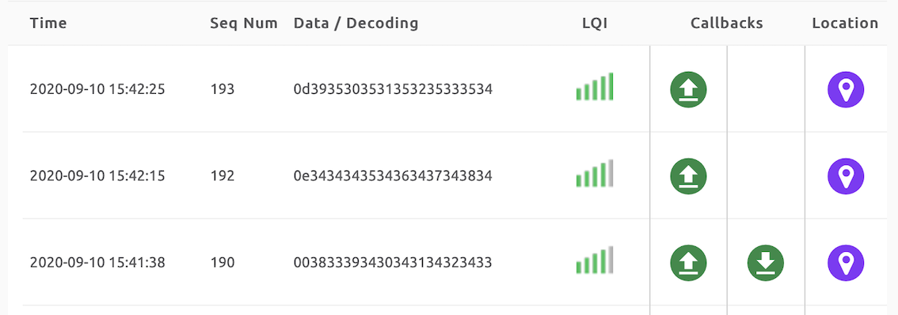

# Callback Setup in Sigfox Cloud

The objective of this tutorial is to show how to configure the callbacks in the Sigfox Cloud.

## Create an account at Sigfox Backend

To register the LoPy4 in the Sigfox Cloud, first you must [Activate](https://buy.sigfox.com/activate) an account.

To Activate the Sigfox account, the ID and PAC of the LoPy are required. 

## Creating the Callback

The following are the steps required to create the callback in the Sigfox Cloud:

1. Login to Sigfox [backend](https://backend.sigfox.com) and go to the "Devices" tab.
2. Click in the value corresponding to your device in the column "Device Type".
3. In the left Menu, go to "Callbacks".
4. In the right top corner click on "New".
5. Select "Custom Callback".
6. Type the following values:
* Type: DATA, BIDIR
* Channel: URL
* Url pattern: ​<url of your end point>
* Use HTTP Method: POS
* Send SNI: {check}
* Headers: authorization, Basic ​<tu token de la cloud function>
* Content type: application/json
* Body:
```json
{
    "deviceType" : "​<device name>​",
    "device" : "{device}",
    "time" : "{time}",
    "data" : "{data}",
    "seqNumber" : "{seqNumber}",
    "ack" : "{ack}"
}
```

The result of the configuration should look as follows:



7.  Save the callback configuration by clicking OK.
8. Verify the correct creation of the callback in the callback page, as follows: 


The callback can be enable and disable with the Enable checkbox. Check that the callback is enable with a SubType BIDIR.


9. Open the file located in /Testing called beacon.py.

10. The beacon.py script sends n = 10 messages to the Sigfox network. This test is build to test the connectivity between the LoPy4, the Sigfox Cloud and the end point. (only one message is required to test the Sigfox connectivity and the correct end point configuration).

``` 
>>> Running beacon.py

>>> 
>>> 
Sending...
Sent.
b'010000'
Sending...
Sent.
b'010001'
Done
```

11. The number of sent messages depends on the "n" configuration. In the previous example n = 2.


## Review Sigfox callback configuration.

Go to the Sigfox Backend page and navigate to Device -> Your-device-ID -> Messages. Check the column "Callbacks". The test is OK if all messages arrived and have a green arrow and a red arrow downwards.



The green arrow upward indicates the status of the message send from device to the Sigfox Cloud, and the downward arrow indicates, that the device has open the reception windows, if red no message was send to the device.

The response content of the end point previously configured in the callback in the Sigfox Cloud is send back to device if the device requested a response (note that the LoPy4 should enable the reception window when a message is expected).


