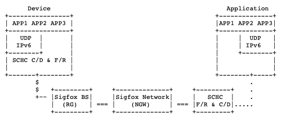
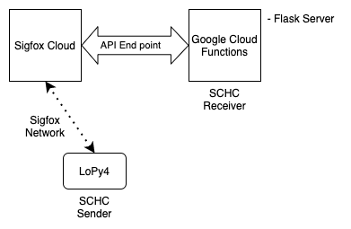

# 1 Create Callback Function in Google Cloud

## Cloud Function Setup for end-to-end communication testing

 The objetive of this tutorial is to configure a Google Cloud account to use the Google Cloud Function (GCF) as an end point to the Sigfox Cloud.
 
 ### Architecture
 
 Acoording to the Generic Framework for Static Context Header Compression and Fragmentation (SCHC [RFC 8724](https://www.rfc-editor.org/rfc/rfc8724.html)), the general LPWAN architecture consists of the following elements:
 
 * Devices (Dev) are the end-devices or hosts (e.g., sensors, actuators, etc.). There can be a very high density of devices per Radio Gateway.
 * The Radio Gateway (RGW) is the endpoint of the constrained link.
 * The Network Gateway (NGW) is the interconnection node between the Radio Gateway and the Internet.
 * The Application Server (App) is the endpoint of the application-level protocol on the Internet side.
 
To leverage each LPWAN technology, each technology defines a Profile that adapt SCHC configuration and Fragmentation/Reassemble (F/R) modes according to its characteristics. More specifically, the [SCHC-over-Sigfox](https://www.ietf.org/id/draft-ietf-lpwan-schc-over-sigfox-03.txt) draft, adapts the SCHC framework to optimally work over the Sigfox radio links. The architecture below shows the replacement of the elements shown before with the Sigfox Network elements.
 
 
 
 In test cases analyzed, the LoPy4 (Device) is connected to the Sigfox Base Station (Radio Gateway). The Sigfox Base Stations communicates with the Sigfox Cloud (Network Gateway) which send the messages to the Google Cloud Function (SCHC F/R). This architecture is shown below.
 
 

## Setup steps for end to end communication testing

1. Create a Google Cloud Function. (this tutorial)
2. Configure the Google Cloud Function as an end-point in Sigfox Cloud. [Tuturial 2](/callback_setup.md)
3. Configure the IDE (vscode or atom) with the extension to support Pycom devices (pymark). [Tuturial 3](/callback_setup.md)
4. Run end-to-end test (LoPy4<->Sigfox<->GCF) [Tuturial 3](/callback_setup.md)

