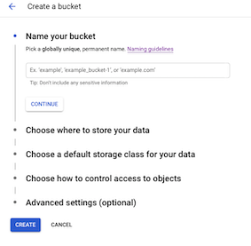

# Create Callback Function in Google Cloud

The objetive of this tutorial is to configure a Google Cloud account to use the Google Cloud Function (GCF) as an end point to the Sigfox Cloud.

## Create a Google Cloud account

Create a google cloud account, can be with a gmail address. More information from this tutorial can be found [here](https://cloud.google.com/functions/docs/quickstart-python) and [here](https://cloud.google.com/functions/docs/first-python).


1. In the Cloud Console, create or select a Cloud Project.

2. Make sure that billing is enabled for your Google Cloud project. (Enable the free tier, payment data must be included but it would not be billed, only if you spend all the free tier).

3. Enable the Cloud Functions and Cloud Build APIs.


### Create CLoud Storage Bucket (required for SCHC implementation in GCF)

1. Go to Menu, Storage.

2. Click on the Create Bucket button.

3. Give Bucket Name (save name for latter) and complete the creation form.



### Create Cloud Function

1. Go to Menu, Functions.
2. Click on the Create Function button.
3. Give the Cloud Function a name. Ex. ``` schc-sigfox```

4. Complete creation form, with region.
5. Set HTTP trigger.
6. Click the required authentication.
7. Copy cloud function URL.
8. Click save and Next.
9. Choose Python 3.7 as Runtime.
10. Copy the following code to the function.

```python
def schc-sigfox(request):
    """Responds to any HTTP request.
    Args:
        request (flask.Request): HTTP request object.
    Returns:
        The response text or any set of values that can be turned into a
        Response object using
        `make_response <http://flask.pocoo.org/docs/1.0/api/#flask.Flask.make_response>`.
    """
    import json
    request_json = request.get_json()
    #if request.args and 'device' in request.args:
    #    return request.args.get('message')
    if request_json and 'device' in request_json and 'data' in request_json:
        respose = {request_json['device']: "downlinkData": request_json['data'] } 
        return json.dumps(response)
    else:
        return f'Not a correct format message'

```
11. Click Deploy and wait for the function to be deploy.


