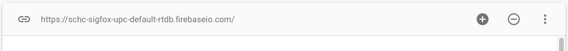
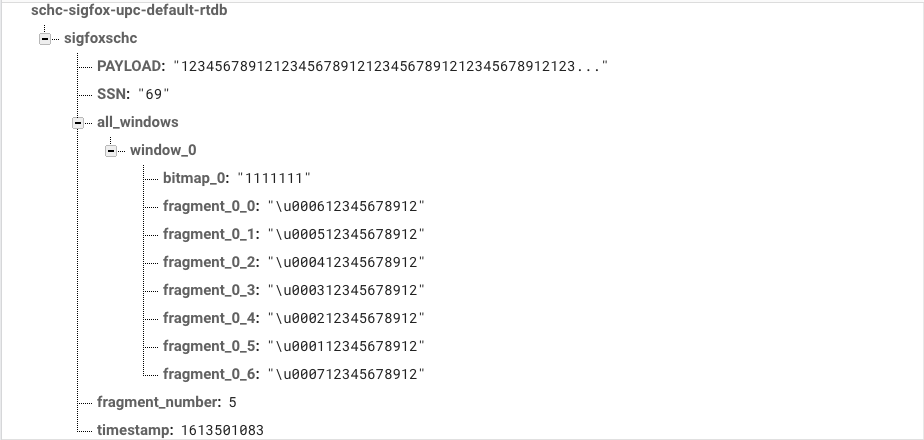

# Guide to add firebase

## Firebase Console

First a Firebase project must be created at the firebase console.

1. Go to https://console.firebase.google.com/ with the same account as the one
used for the Google Cloud Functions.

2. Click in Add Project.

3. Set project name e.g., schc-sigfox

4. Set your google cloud organisation. 

5. Enable or disable analytics (they are not need).

6. Click in Create project.

Now wait until the project is created and click Continue. Once the project is ready:

1. Go to project configuration, project configuration.

2. Go to Service Account.

3. Click on the Generate new private key button.

4. Download the json file to the credentials folder. 

Now go to Realtime database tab:
 
1. Click Create Database.

2. Select Region (should be the same as the Google Cloud Functions)

2. Select the "Start in lock mode" option. 
The lock mode does not allows read and writes outside the admin sdk.

3. Click Enable.

Wait until the database is created. 

Copy the Realtime database URL.


 
Paste the Realtime database URL in the config.py file, using the FIREBASE_RTDB_URL variable.

## Example data structure of the Realtime data base

The figure below shows the structure of the Realtime database. 
The main node will have the same of the BUCKET_NAME variable from config.py.

The all_windows node, will have the information of each window.



To check if everything is configured correctly, run test_database.py.
This script will init the database class, save some example data to the database,
read the data, delete the data and clean the database.

```text
python3 test_database.py
init db + sigfoxschc
[DATABASE]: saving in sigfoxschc/test-database
[DATABASE]: reading from sigfoxschc/test-database
some example text
[DATABASE]: deleting from sigfoxschc/test-database
[DATABASE]: deleting from sigfoxschc
```
In the example above, the bucket name is sigfoxschc, and the blob name is test-database.

For more information about the Realtime database, please vist the [Firebase Realtime Database Docs](https://firebase.google.com/docs/database/admin/start).


