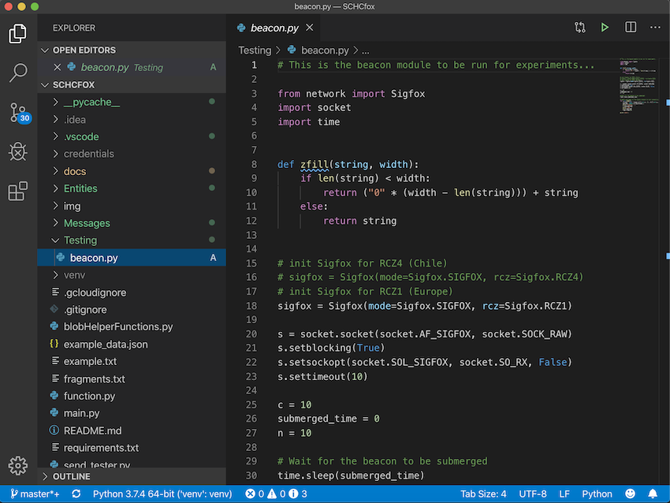
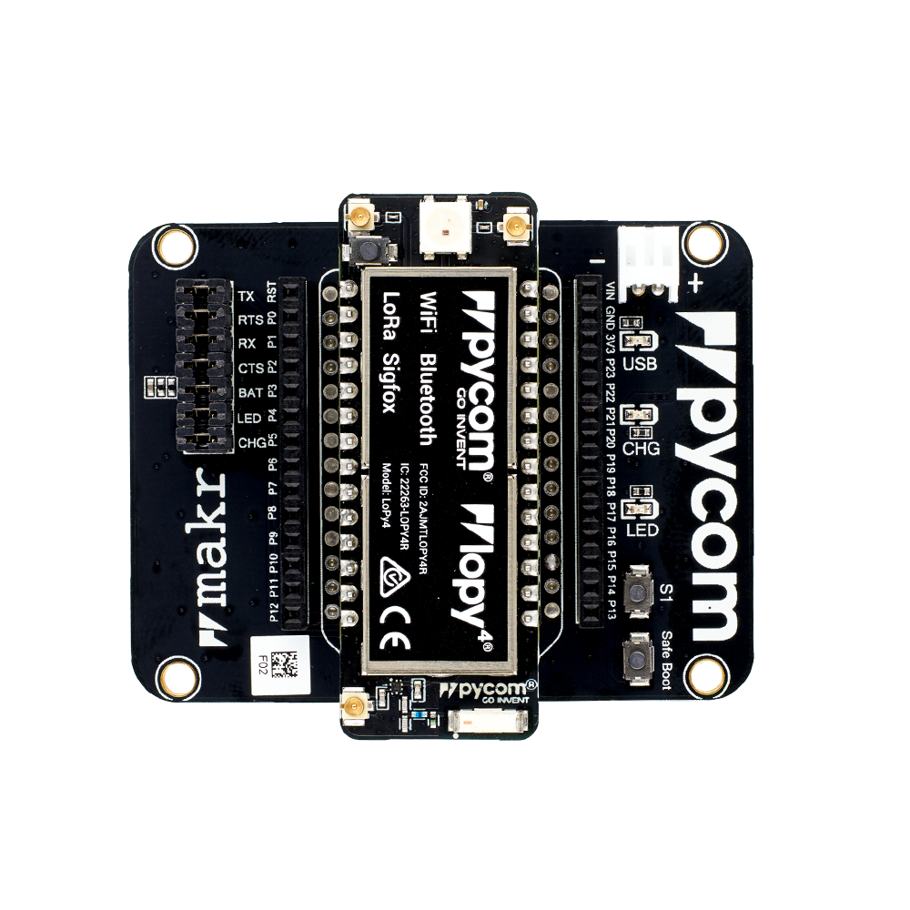
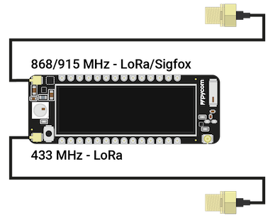
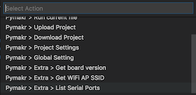
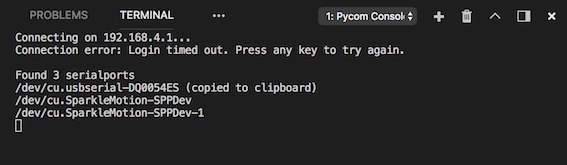
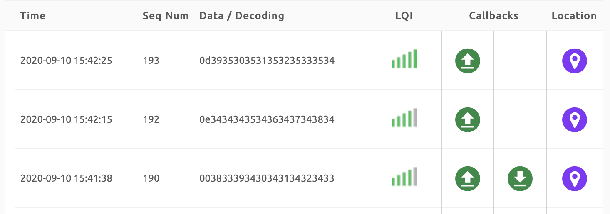

# LoPy Setup in vscode

The objective of this tutorial is to show how to setup the LoPy4 in the Visual Studio Code (vscode).

The installation guide is based in the pycom [documentation.](https://docs.pycom.io/gettingstarted/software/vscode/)

Pycom supports Microsoft’s Visual Studio Code IDE platform with the Pymakr Plugin.

1. First download and install [Visual Studio Code](https://code.visualstudio.com/).

2. You will also need NodeJS installed on your PC. Please download the latest LTS version available [from the NodeJS website](https://nodejs.org/).

Please follow these steps to install [the Pymakr VSCode Extension](https://marketplace.visualstudio.com/items?itemName=pycom.Pymakr):

3. Ensure that you have the latest VSCode installed and open.

4. Navigate to the Extensions page, using the 5th button in the left navigation.

5. Search for Pymakr and click the install button next to it.

6. Within a few minutes, a reload button should appear. Press it to reload VSCode.

7. Open project from [this](https://github.com/saguilarDevel/schc-sigfox) repository.



8. Open the file located in /Testing called beacon.py.

9. The beacon.py script sends n = 10 messages to the Sigfox network. This test is build to test the connectivity between the LoPy4, the Sigfox Cloud and the end point. (only one message is required to test the Sigfox connectivity and the correct end point configuration).


10. Note that the LoPy4 is connected to the expansion board previously as follows: 



11. Connect the antenna to the corresponding port of the LoPy4. 




12. Connect the LoPy4 device to your computer using the USB Port.

13. Ensure that the Pymakr Plugin has correctly installed.


14. Generally, your device will be auto-detected. If this does not work, click All commands on the bottom of the Visual Studio Code window.


15. In the list that appears, click Pymakr > Extra > List Serial Ports.



16. This will list the available serial ports. If Pymakr is able to auto-detect which to use, this will be copied to your clipboard. If not please manually copy the correct serial port.



17. Download the beacon.py file to the LoPy4 by clicking in the menu below and click Run current file.

18. The file will be executed.

19. It should print

``` 
Sending...
Sent.
Done.
```

20. The number of sent messages depends on the "n" configuration.


## Review Sigfox callback configuration.

Go to the Sigfox Backend page and navigate to Device -> Your-device-ID -> Messages. Check the column "Callbacks". The test is OK if all messages arrived and have a green arrow and a red arrow downwards.



The green arrow upward indicates the status of the message send from device to the Sigfox Cloud, and the downward arrow indicates, that the device has open the reception windows, if red no message was send to the device.

The response content of the end point previously configured in the callback in the Sigfox Cloud is send back to device if the device requested a response (note that the LoPy4 should enable the reception window when a message is expected).


