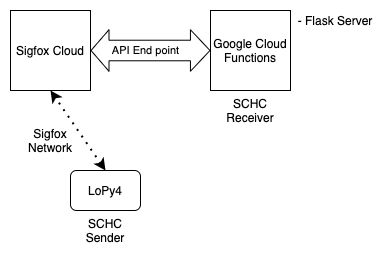
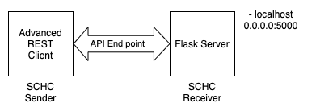

# Test setup for SCHC over Sigfox

## Objectives

Provide different ways of testing the schc over sigfox implementation.

The final goal is to connect a device (LoPy4) thru the Sigfox Cloud to a server (Google Cloud or Private Cloud) that enables SCHC (fragmentation) connectivity. 

## Connection Diagram

To enable SCHC connectivity over Sigfox, the device is connected to the Sigfox network. The messages sent by the device arrive to the Sigfox Cloud that retransmit the message payload and other information, such as the sequence number, timestamp and device type, device ID and ACK flag.



Example of Sigfox Cloud message send to Google Cloud Function.

```json
{
  "deviceType": "01B29CC4",
  "device": "1B29CC4",
  "time": "1596713121",
  "data": "303130303030",
  "seqNumber": "39",
  "ack": "false"
}
```

Furthermore, the Sigfox Cloud endopoint can be configure to a Private Cloud, running a Flask Server.


## Testing SCHC over Sigfox

To accomplish the final configuration, different test cases have been analyzed.

### Test case 1 - Local tests

The SCHC over Sigfox implementation was tested in local mode, using http sockets in localhost. 
This test setup allows a rapid implementation of the python code, as test are run locally.


### Test case 2 - Testing Server Code Locally

To test the code that will run on the server (Google Cloud or Private Cloud), the Sigfox Cloud (and the device) are replace by a http post sender tool (Advance REST Client in this case, curl is another option). This setup allows a simpler way to test the code running in the server, as it does not need to be deploy to the Cloud each time a change is made. 

A Flask server is run in localhost (port 5000), and messages are send to an endpoint in /post/messages. The messages are take from real messages send from the Sigfox Cloud.



### Test case 3 - Testing Server Code Locally Programmatically

To simulate the sending of messages more programmatically, a python script with a series of messages is configure to send the messages to the Flask server locally. 


### Test case 4 - Testing Google Cloud Function

Once the test in local provide good results, the server can be deploy to Google Cloud as a Function. To test the function without the need of the Sigfox Cloud, the Advanced REST Client can be use to send the messages. Also the Python script can be use to send the messages programmatically.


